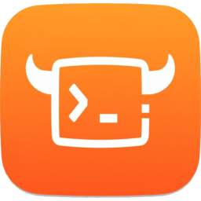

### 安全能力融合 · AI 原生的网络安全技术栈

<em>A CDSL-centric, AI-native cybersecurity technology stack — one language, one engine, one platform.</em>

 

 

---

## 我们是谁 · About Us

**Yaklang.io 团队** 是国内最早提出「安全生态共建」与「安全能力融合」理念的安全团队，专注开源社区，始终坚持「做难而正确的事」。

我们围绕一门自研的网络安全领域专用语言（**CDSL**）构建了一整套从编译器、虚拟机到安全平台、AI 智能体的技术栈，覆盖大部分「数据描述语言 / 容器语言」的超集能力，帮助安全从业者用一门语言完成从安全能力研发到实战交付的全过程。

> *Yaklang.io is an open-source security team building a full technology stack around a self-designed Cybersecurity Domain-Specific Language (CDSL) — from compiler and virtual machine to security platform and AI agents — so that practitioners can research, build, and deliver security capabilities in a single language.*

<table>
<tr>
<td width="33%" valign="top">

### 安全能力融合
**Capability Fusion**

打破工具与安全细分领域之间的壁垒，把扫描器、PoC、Fuzzer、流量分析、漏洞算法统一到同一个语言与平台之上。

</td>
<td width="33%" valign="top">

### CDSL 理念
**Language-Driven**

用领域专用语言天然分离「业务意图」与「能力实现」，让非专业人员也能构建严肃的安全产品。

</td>
<td width="33%" valign="top">

### AI 原生
**AI-Native**

从记忆、规划、工具到知识检索，原生构建可控、可追溯、可进化的安全智能体体系。

</td>
</tr>
</table>

---

## 技术内核 · The Core

围绕 **CDSL** 我们构建了完整的编译与运行时基座：

| 组件 | 说明 · Description |
| :--- | :--- |
| **CDSL Yaklang** | 面向网络安全的领域专用语言，强类型 + 动态特性，支持字节码编译与解释执行 |
| **YakVM** | 承载图灵完备语言运行时的专用栈虚拟机，一次编写、随处运行 |
| **YAK SSA** | 为静态分析优化的静态单赋值形式，支撑多语言代码审计 |
| **SyntaxFlow** | 用于语法模式匹配与漏洞特征建模的 DSL |
| **LSP / DSP Server** | 语言服务与调试服务协议，驱动编辑器智能与断点调试 |

---

## 产品矩阵 · Product Matrix

### 语言与引擎 · Language & Engine

| 项目 | 简介 | 链接 |
| :--- | :--- | :--- |
| **Yaklang** | 专为网络安全设计的编程语言与引擎（CDSL + YakVM + SSA + SyntaxFlow） | [`yaklang/yaklang`](https://github.com/yaklang/yaklang) |
| **Yaklang for VS Code** | 官方编辑器扩展：语法高亮、LSP 智能补全、调试、一键运行 | [`yaklang/yaklang-support`](https://github.com/yaklang/yaklang-support) |

### 一站式安全平台 · All-in-One Platform

| 项目 | 简介 | 链接 |
| :--- | :--- | :--- |
| **Yakit** | 交互式应用安全测试平台与 Yaklang 原生 IDE：MITM、Web Fuzzer、插件商店、报告一体化 | [`yaklang/yakit`](https://github.com/yaklang/yakit) |
| **官网与文档** | yaklang.com / yaklang.io 的站点与使用手册 | [`yaklang/yaklang.github.io`](https://github.com/yaklang) |

### AI × 安全 · AI Meets Security

| 项目 | 简介 | 链接 |
| :--- | :--- | :--- |
| **Memfit AI** | 递归式双引擎（Plan-Execute + ReAct）智能体平台，由 YAK 生态驱动 | [memfit.ai](https://memfit.ai) |
| **AI 系统设计** | C.O.R.E. P.A.C.T. 记忆评分框架、三层评审、快慢路径等核心设计 | `yaklang-ai-system-design` |
| **Agentic RAG 服务** | rag.yaklang.com 背后的流式智能检索问答服务 | `yaklang-knowledge-base-rag-server` |

### Agent 评测 · 靶场 · 知识 · Eval, Range & Knowledge

| 项目 | 简介 | 链接 |
| :--- | :--- | :--- |
| **HackSkills** | 面向 AI Agent 的攻防技能库，101 技能 / 14 安全领域 | [`yaklang/hack-skills`](https://github.com/yaklang/hack-skills) |
| **HackBenchmark** | 前沿 AI 智能体在真实漏洞场景下的可复现评测基准 | [hackbenchmark.com](https://hackbenchmark.com) |
| **RedHaze Range** | 「模拟真实企业」的 AI 安全评测靶场，6 子系统 / 69 漏洞 | `yaklang/redhaze-range` |
| **Yak Skills** | 面向 Agent 的 Yaklang 编程与热加载技能库 | [skills.yaklang.io](https://skills.yaklang.io) |
| **AI 训练素材** | 100+ 标准库实战、语法案例与完整安全脚本 | `yaklang-ai-training-materials` |

---

## 数字一览 · By the Numbers

| 🐂 创立 | 📦 开源仓库 | ⭐ Yakit | 🌐 站点 | 🎓 学术指导 |
| :---: | :---: | :---: | :---: | :---: |
| 2021 | 40+ | 7k+ | 6+ | UESTC |

- **2021 年至今** 持续迭代，深耕开源社区与企业实践。
- **多个官方站点**：yaklang.com · memfit.ai · ssa.to · rag.yaklang.com · skills.yaklang.io · hackbenchmark.com。
- **学术支撑**：由电子科技大学网络空间安全学院 **张小松教授** 提供学术指导。

> *Iterating since 2021, with academic guidance from Prof. Zhang Xiaosong, School of Cyberspace Security, UESTC.*

---

## 加入我们 · Join Us

- 💬 通过 [Yaklang](https://github.com/yaklang/yaklang/issues) / [Yakit](https://github.com/yaklang/yakit/issues) 的 Issue 区参与讨论与反馈，中英文皆可。
- 📖 阅读 [官方文档](https://yaklang.com) 与 [Yakit 使用手册](https://yaklang.io/products/intro/) 快速上手。
- 📰 国内用户可关注微信公众号 **「Yak Project」** 加入社区与交流群。
- 🛠️ 欢迎提交 PR（建议附带单元测试）；若涉及核心语法或 YakVM，请先联系研发团队。

 

**做难而正确的事 · Do the hard, right things.**

© Yaklang.io Project · 学术指导：电子科技大学网络空间安全学院

