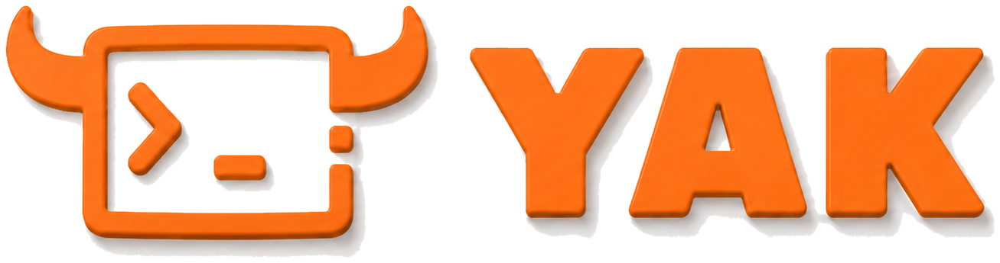

  

**安全能力融合 · AI 原生的网络安全技术栈**　|　<em>A CDSL-centric, AI-native cybersecurity stack</em>

国内最早提出「安全能力融合」理念的开源安全团队，围绕自研网络安全领域专用语言 **CDSL（Yaklang）**，构建从语言、引擎到安全平台与 AI 智能体的完整技术栈。

<em>An open-source security team building a full stack — language, engine, platform and AI agents — around a self-designed Cybersecurity DSL (CDSL / Yaklang).</em>

| 方向 Track | 项目 Projects | 简介 About |
| :-- | :-- | :-- |
| CDSL 引擎 | [Yaklang](https://yaklang.com) | 网络安全领域编程语言与虚拟机引擎 |
| 生产力产品 | [Yakit](https://yaklang.com) · [IRify 代码审计](https://ssa.to) | 交互式安全测试平台与代码审计 |
| AI x 安全 | [Memfit 安全 Agent](https://memfit.ai) · [YAK 知识库](https://rag.yaklang.com) | 安全智能体与 Agentic 知识检索 |
| 安全能力评估 | [HackSkills](https://skills.hackbenchmark.com) · [YakSkills](https://skills.yaklang.io) | AI Agent 攻防技能库与评测基准 |

做难而正确的事 · Do the hard, right things.　|　微信公众号「Yak Project」　·　© Yaklang.io Project
